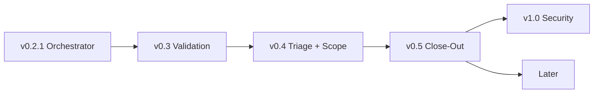
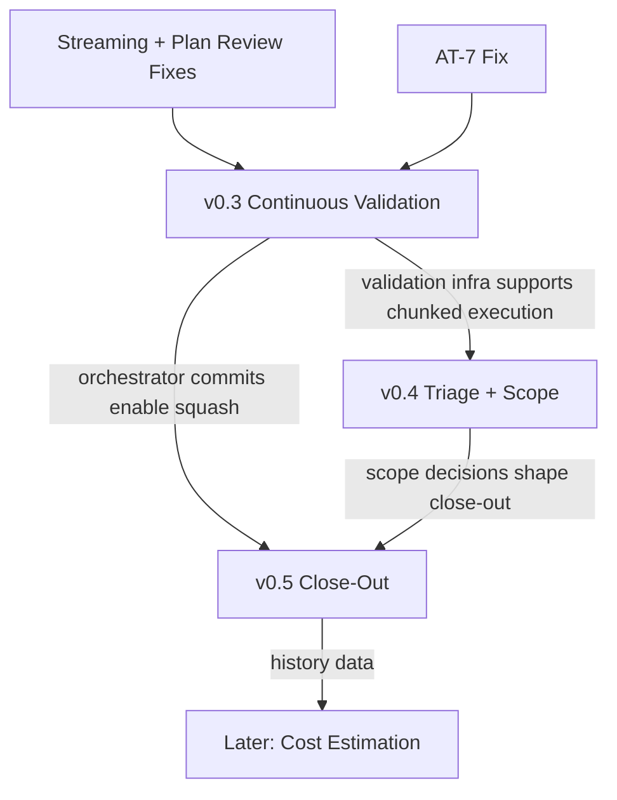

# Roadmap

Versioned milestones for pi-superteam. Derived from the [post-run-1 assessment](post-run-1-assessment.md) and [next-batch task list](plans/next-batch.md).

The three structural changes identified in run 1 — continuous validation, brainstorm triage, and workflow close-out — define the milestone boundaries. Individual tasks are slotted into the milestone where they naturally contribute, not listed in priority order.

Current version: **v0.3-batch1** (2026-02-08).

## Milestone Overview

Each milestone builds on the last. v0.3 makes execution self-correcting (cross-task tests, cost visibility, checkpoints). v0.4 makes brainstorm the intelligence layer (triage, chunking, splitting). v0.5 makes workflows shippable (finalize, docs, archival). v1.0 adds the security and trust model required for unattended/CI deployment.

### Dependency flow

The milestones are not purely linear — there are specific technical dependencies between them:

---

## v0.3 — Continuous Validation & Course Correction

**Theme**: The workflow must catch regressions as they happen, show cost throughout, and let the user steer mid-execution.

Run 1 proved this is the most dangerous gap. Task 19 broke AT-7 silently — discovered only at finalize. No cost visibility existed during the run. The user had no pause point to reassess after seeing early results. This milestone makes the execute phase self-correcting.

> **Dev note**: v0.3 is the largest milestone. For development purposes it should be chunked into focused batches (e.g., validation infrastructure → checkpoints/revision → git safety → streaming/UX) with reassessment between them.

### Core deliverables

1. **Cross-task test suite after every task** — After a task's own reviews pass, run the full test suite (not just the task's tests). If tests fail, stop execution and surface the failure before proceeding to the next task. Configurable: every task, every N tasks, or on-demand.

2. **Progress summaries with cost** — After each task, emit a deterministic summary: tasks completed / remaining, cumulative cost, estimated cost to finish, changed files so far, fix cycles so far. Display via `ui.notify`. No LLM needed — computed from `OrchestratorState`.

3. **Checkpoint pause points** — At configurable intervals (default: after every task in checkpoint mode), prompt: "5/20 done, $15 spent, ~$33 remaining. Continue / Adjust plan / Abort?" In auto mode, checkpoints fire only on test failure or budget threshold.

4. **Minimal plan revision at checkpoints** — "Adjust plan" is real, not theater. At any checkpoint the user can: drop remaining tasks, reorder tasks, mark tasks as skip. No new task insertion, no re-brainstorm, no full rewrite — just subtractive/reorder edits to the existing plan. The orchestrator re-parses the modified plan and continues. This replaces the full `/workflow revise` (deferred to Later) with a pragmatic subset that covers the common case: "we learned something, let's cut scope."

5. **Orchestrator-controlled git commits** — Don't rely on the implementer to commit. After a task passes all reviews and validation, the orchestrator commits with a standardized message (`workflow: task N — <title>`). Enables clean rollback, consistent history, and future commit-squash in close-out.

6. **Test baseline & flake policy** — Continuous validation only works with a realistic test model. First run captures baseline (which tests pass/fail before we touch anything). Known pre-existing failures are allowlisted — we don't block on tests that were already broken. On unexpected failure, re-run once; if the result flips, classify as flake (warn, don't block). Genuine new regressions stop execution.

7. **Git safety preflight** — Before orchestrator-controlled commits can work, we need guardrails: check for dirty working tree at workflow start (stash or abort), warn if on `main`/`master` (suggest branch), configurable ignore patterns for generated files and lockfile churn.

8. **Failure taxonomy & default actions** — Classify failures and assign default recovery instead of "stop and surface" everywhere:

   | Failure type | Default action |
   |---|---|
   | Parse error | Auto-retry (already implemented) |
   | Test failure (genuine regression) | Stop, show diff vs baseline |
   | Test failure (flake) | Warn, continue |
   | Test failure (pre-existing) | Ignore (allowlisted) |
   | Tool/command timeout | Retry once, then escalate to user |
   | Budget threshold exceeded | Checkpoint (not hard stop) |
   | Reviewer disagreement (v0.4+) | Surface both findings, user decides |

### Prerequisite fixes (included in this milestone)

These aren't structural changes but they must land before continuous validation works correctly:

- **Fix AT-7 regression** — The brainstorm acceptance test broken by the skip feature. Add the missing `ui.select` mock so the test exercises all sub-steps again. Must fix before cross-task validation can be trusted as a baseline.

- **Streaming feedback for all phases** — Brainstorm, plan-write, and plan-review currently dispatch agents with no `onStreamEvent` callback. The UI appears frozen for 10–60+ seconds. Wire `makeOnStreamEvent()` into all `dispatchAgent()` calls. Without this, continuous validation's pause points would be the only sign of life — not enough.

- **Plan review role separation** — The reviewer judges and provides specific fix-this instructions with a pass/fail verdict. The reviewer never alters the plan. The plan writer receives the findings and applies targeted fixes. Restrict reviewer scope to structure, completeness, dependencies, and granularity — explicitly NOT inline test code, argument indices, or line-level correctness.

- **Reviewer write-guard** — Enforce "reviewer never edits" with a post-dispatch assertion: if any reviewer agent's tool calls include file writes, reject the response and re-dispatch. Convention alone drifts under prompt pressure; a lightweight runtime check catches it without needing a full permissions system.

- **Plan revision strategy** — The plan writer applies targeted patches based on reviewer findings (never full rewrites). After N automated review-fix passes (default 2), if still not converging, the user sees the outstanding findings and decides: approve as-is, provide specific guidance, or abort. This is the missing human escalation path — run 1 had no checkpoint when plan-review went in circles.

### Supporting items

- **Minimal config story** — `.superteam.json` already exists. Define what v0.3 reads from it: `testCommand` (override auto-detection), `validationCadence` (`"every"` | `"every-N"` | `"on-demand"`), `budgetLimit` (dollar threshold for checkpoint), `ignorePatterns` (files to exclude from commit/diff). No schema validation, no profiles — just read-and-use.

- **Rollback on escalation** — On max-retry escalation, offer Rollback alongside Retry/Skip/Abort. Uses the `gitShaBeforeImpl` already tracked in `TaskExecState`. Natural companion to orchestrator-controlled commits.

- **Post-task context forwarding** — Each implementer gets a lightweight summary of what prior tasks changed (files modified, key decisions). Not full output — just enough to avoid contradicting earlier work. Feeds from the progress summaries above.

- **Pre-review validation gate** — Run `tsc --noEmit` (or project-appropriate equivalent) after implementation, before dispatching reviewers. Catches syntax errors before wasting a review cycle. Natural companion to cross-task validation.

### Ships when

- Cross-task validation runs after each task and catches a genuine regression (demonstrated in our own repo).
- Flake policy correctly distinguishes flaky vs genuine failures (at least one known-flaky test handled without blocking).
- Checkpoints pause execution; user can continue, drop/reorder/skip tasks, or abort — and the workflow respects the choice.
- Orchestrator commits land with standardized messages; dirty-tree and branch checks work.
- Streaming feedback is wired for all dispatch phases (no frozen UI > 5 seconds).
- All current acceptance tests pass (including AT-7 fix).

### Out of scope for v0.3

- Brainstorm triage and chunking — that's v0.4.
- Finalize improvements — that's v0.5.
- Parallel task execution — blocked on git worktree integration, firmly in Later.

---

## v0.4 — Brainstorm Triage & Scope Management

**Theme**: The brainstorm phase becomes the system's intelligence layer. It determines how much process a change needs, whether the scope should be chunked, and whether independent pieces should split into separate workflows. All decisions are collaborative with the user.

The priority ordering is quality of output first, then cost, then speed. Every process decision asks: does this produce higher-quality results? We don't skip steps to save time — we skip steps that don't improve the output.

### Core deliverables

1. **Collaborative brainstorm triage** — After scouting, the brainstormer recommends how much design thinking this change actually needs:
   - *Straightforward* — "this is a focused change with a clear path, skip to planning."
   - *Needs exploration* — "there are meaningful design choices, let's work through questions and approaches."
   - *Complex* — "this touches multiple systems, let's go deep with multi-turn discussion."

   The user always confirms or overrides. "I think this is straightforward" / "actually, I want to explore approaches." The brainstormer proposes, the user disposes. Triage is a conversation, not a heuristic.

2. **Chunking for breadth** — When the spec is broad (many files, wide surface area), brainstorm recommends chunking into sequential batches. Each batch gets its own plan-execute-reassess cycle rather than one monolithic 20-task plan. This improves quality: focused plans produce better implementation than sprawling ones. The brainstormer proposes batch boundaries, the user confirms.

3. **Workflow splitting** — When brainstorm (with the user) determines the spec contains genuinely independent pieces — say, a new API endpoint and a separate CLI refactor that don't touch each other — those become separate workflow runs. Each gets its own brainstorm, plan, execute, finalize. Coupled pieces stay together. The brainstormer proposes the split boundaries, the user confirms.

4. **Richer brainstorm interaction** — Multi-turn discussion on questions and approaches. Go-back capability. Recap before proceeding. Uses ctx.ui.custom() pattern. Deferred questions become "user deferred — use your best judgment." The brainstorm conversation IS the triage mechanism — depth of interaction scales naturally with complexity.

### Design principle: reviews always run

All reviewers always run on every task, full set. Small changes make for small reviews — they pass quickly. But they still catch unforeseen risks. A one-line auth change is "small" but security review should absolutely see it. The quality bar doesn't drop for small changes; the process scales down in brainstorm and planning, not in verification.

### Supporting items

- **Parallel spec + quality reviews** — Spec and quality reviews are independent — run them concurrently via dispatchParallel. Saves wall-clock time per task without reducing review quality. Requires review-finding deduplication when findings overlap or conflict.

- **Execute phase agent visibility** — Show current agent name + model in status bar during dispatch. Task title alongside activity stream. Expandable task detail. Important when multiple reviewers run per task.

### Ships when

- Brainstorm triage proposes complexity level; user confirms or overrides; process depth adjusts accordingly.
- A broad spec is chunked into batches with per-batch plan-execute-reassess cycles.
- Independent pieces can split into separate workflow runs.
- Parallel spec + quality reviews run concurrently and findings are presented coherently.

### Out of scope for v0.4

- Documentation update or finalize improvements — that's v0.5.
- Parallel task execution across tasks — separate from parallel reviews within a task. Stays in Later.

---

## v0.5 — Workflow Close-Out

**Theme**: The workflow isn't done until the project is clean, documented, and shippable. Finalize becomes a real phase.

Run 1's finalize was a bare stats dump. No per-task costs, no commit SHAs, no prose summary, no docs update, no cleanup. The user was left with scattered artifacts and a "workflow complete" message. This milestone makes close-out a first-class phase.

### Core deliverables

1. **Rich finalize report** — Deterministic summary from state: per-task cost breakdown, commit SHA per task, timeline (started/finished per task), total fix cycles, reviewer pass/fail per task. Plus a prose summary dispatched via a lightweight summarizer agent that reads task titles + changed files + design doc and writes 5–6 bullet points. Saved to `docs/plans/YYYY-MM-DD-<slug>-summary.md`. Summarizer is strictly grounded: it receives only commit/file/diff inputs and summarizes those — no interpretation beyond the data.

2. **Documentation update skill** — After the finalize report, prompt: "Update project documentation?" If yes, dispatch an agent that reads changed files + design doc + existing docs (README, CHANGELOG, `.pi/context.md`) and identifies what needs updating. Produces a checklist or applies updates directly. Built as a reusable skill (`skills/documentation-update/`) so it works outside workflows too.

3. **Artifact archival** — Move current workflow's artifacts (design doc, plan, plan revisions, progress file, summary) into `docs/plans/archive/YYYY-MM-DD-<slug>/`. Clean the working directory for the next workflow run. Teams that prefer not to commit archives can `.gitignore` the archive directory.

4. **Optional commit squash** — Offer to squash per-task commits (from v0.3's orchestrator-controlled commits) into a single merge commit with a comprehensive message summarizing all changes. Uses `squashCommitsSince` from `git-utils.ts`. Note: the finalize report captures per-task SHAs *before* squash is offered — post-squash, the report serves as historical record of the granular commits.

### Supporting items

- **Retrospective data** — Save run metrics (cost per phase, task count, fix cycles, duration, mode used) to `.superteam-history.json`. Foundation for future cost estimation ("last 5 workflows averaged $X per task") and process improvement tracking. Location is local-only (not committed) — cost metadata is often sensitive.

- **Resume UX polish** — When resuming a workflow mid-brainstorm or mid-execute, show recap of prior state before continuing. "You answered 3/5 questions. Continuing from question 4..." / "Tasks 1–7 complete. Resuming from task 8."

### Ships when

- Finalize report includes per-task cost, SHAs, timeline, and prose summary.
- Documentation update skill identifies stale docs and produces updates (or checklist).
- Artifacts are archived cleanly; working directory is ready for next workflow.
- Commit squash works and finalize report preserves pre-squash SHAs as historical record.

### Out of scope for v0.5

- Cost estimation before execution — needs history data from multiple runs first. Tracked in FUTURE.md.
- Workflow history analytics — needs more runs. The data capture lands here; analysis is Later.

---

## Later

Items that don't fit v0.3–v0.5 or are blocked on prerequisites. Tracked in [FUTURE.md](FUTURE.md).

### v1.0 — Security & Trust

- **Prompt injection threat model** — untrusted repo content (comments, strings, file names) influencing agent behavior. Requires analysis of attack surface and mitigation strategy.
- **Command sandboxing** — restrict what commands agents can execute; handle secrets, env vars, and network access. Especially important as autonomy increases.
- **Tool permission model** — per-role tool restrictions (reviewers can't write files, implementers can't modify outside task scope). Builds on the lightweight reviewer write-guard from v0.3.
- **Exfiltration protections** — prevent agents from leaking repo content through tool calls or model APIs.

Not blocking for alpha/beta (local CLI, user present, single-tenant). Required before any unattended/CI or multi-tenant deployment.

### Infrastructure & Optimization

- **Parallel task execution** — dispatch multiple implementers concurrently using the plan's dependency graph. Blocked on git worktree integration to avoid merge conflicts.
- **Git worktree integration** — isolate parallel agents in worktrees, orchestrator merges after completion. Prerequisite for parallel execution.
- **Cost estimation before execution** — predict total cost from task count × historical average. Needs `.superteam-history.json` data from v0.5.
- **Custom review profiles** — project-specific reviewer config in `.superteam.json`. Wait for real user demand; tiered modes cover most needs.
- **Model rotation / fallback** — try alternative model on rate limit or outage. Current failure rates don't justify the complexity.
- **Agent evaluation harness** — compare agent configs against the same task. Do when seriously benchmarking models.
- **Full incremental plan updates** — `/workflow revise` for arbitrary edits (add tasks, restructure, re-brainstorm) mid-execution. v0.3's minimal revision (drop/reorder/skip) covers the common case; full revision deferred until demand justifies it.

---

## Version history

| Version | Date | Summary |
|---------|------|---------|
| v0.2.0 | 2026-02-07 | Workflow orchestrator: 5-phase state machine, structured interaction, agent dispatch |
| v0.2.1 | 2026-02-07 | Bug fixes: task parser, brainstorm JSON parsing, status bar, confirm dialogs |
| v0.3-b1 | 2026-02-08 | Batch 1: AT-7 fix, streaming, plan-review discipline, write-guard, targeted revision, config keys, plan-parser extraction |
| v0.3 | — | Continuous validation, test baseline, checkpoints with minimal revision, git safety, failure taxonomy |
| v0.4 | — | Brainstorm triage, chunking for breadth, workflow splitting, richer interaction |
| v0.5 | — | Workflow close-out: rich finalize, docs update skill, archival, commit squash |
| v1.0 | — | Security & trust: prompt injection, sandboxing, tool permissions, exfiltration |
