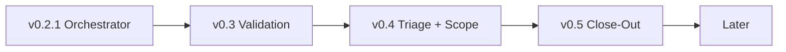

# Roadmap

Versioned milestones for pi-superteam. Derived from the [post-run-1 assessment](post-run-1-assessment.md) and [next-batch task list](plans/next-batch.md).

The three structural changes identified in run 1 — continuous validation, brainstorm triage, and workflow close-out — define the milestone boundaries. Individual tasks are slotted into the milestone where they naturally contribute, not listed in priority order.

Current version: **v0.2.1** (2026-02-08).

## Milestone Overview

Each milestone builds on the last. v0.3 makes execution self-correcting (cross-task tests, cost visibility, checkpoints). v0.4 makes brainstorm the intelligence layer (triage, chunking, splitting). v0.5 makes workflows shippable (finalize, docs, archival).

### Dependency flow

The milestones are not purely linear — there are specific technical dependencies between them:

---

## v0.3 — Continuous Validation & Course Correction

**Theme**: The workflow must catch regressions as they happen, show cost throughout, and let the user steer mid-execution.

Run 1 proved this is the most dangerous gap. Task 19 broke AT-7 silently — discovered only at finalize. No cost visibility existed during the run. The user had no pause point to reassess after seeing early results. This milestone makes the execute phase self-correcting.

### Core deliverables

1. **Cross-task test suite after every task** — After a task's own reviews pass, run the full test suite (not just the task's tests). If tests fail, stop execution and surface the failure before proceeding to the next task. Configurable: every task, every N tasks, or on-demand.

2. **Progress summaries with cost** — After each task, emit a deterministic summary: tasks completed / remaining, cumulative cost, estimated cost to finish, changed files so far, fix cycles so far. Display via `ui.notify`. No LLM needed — computed from `OrchestratorState`.

3. **Checkpoint pause points** — At configurable intervals (default: after every task in checkpoint mode), prompt: "5/20 done, $15 spent, ~$33 remaining. Continue / Adjust plan / Abort?" The user can stop, re-scope, or keep going. In auto mode, checkpoints fire only on test failure or budget threshold.

4. **Orchestrator-controlled git commits** — Don't rely on the implementer to commit. After a task passes all reviews and validation, the orchestrator commits with a standardized message (`workflow: task N — <title>`). Enables clean rollback, consistent history, and future commit-squash in close-out.

### Prerequisite fixes (included in this milestone)

These aren't structural changes but they must land before continuous validation works correctly:

- **Fix AT-7 regression** — The brainstorm acceptance test broken by the skip feature. Add the missing `ui.select` mock so the test exercises all sub-steps again. Must fix before cross-task validation can be trusted as a baseline.

- **Streaming feedback for all phases** — Brainstorm, plan-write, and plan-review currently dispatch agents with no `onStreamEvent` callback. The UI appears frozen for 10–60+ seconds. Wire `makeOnStreamEvent()` into all `dispatchAgent()` calls. Without this, continuous validation's pause points would be the only sign of life — not enough.

- **Plan review role separation** — The reviewer judges and provides specific fix-this instructions with a pass/fail verdict. The reviewer never alters the plan. The plan writer receives the findings and applies targeted fixes. Restrict reviewer scope to structure, completeness, dependencies, and granularity — explicitly NOT inline test code, argument indices, or line-level correctness.

- **Plan revision strategy** — The plan writer applies targeted patches based on reviewer findings (never full rewrites). After N automated review-fix passes (default 2), if still not converging, the user sees the outstanding findings and decides: approve as-is, provide specific guidance, or abort. This is the missing human escalation path — run 1 had no checkpoint when plan-review went in circles.

### Supporting items

- **Rollback on escalation** — On max-retry escalation, offer Rollback alongside Retry/Skip/Abort. Uses the `gitShaBeforeImpl` already tracked in `TaskExecState`. Natural companion to orchestrator-controlled commits.

- **Post-task context forwarding** — Each implementer gets a lightweight summary of what prior tasks changed (files modified, key decisions). Not full output — just enough to avoid contradicting earlier work. Feeds from the progress summaries above.

- **Pre-review validation gate** — Run `tsc --noEmit` (or project-appropriate equivalent) after implementation, before dispatching reviewers. Catches syntax errors before wasting a review cycle. Natural companion to cross-task validation.

### Out of scope for v0.3

- Brainstorm triage and chunking — that's v0.4.
- Finalize improvements — that's v0.5.
- Parallel task execution — blocked on git worktree integration, firmly in Later.

---

## v0.4 — Brainstorm Triage & Scope Management

**Theme**: The brainstorm phase becomes the system's intelligence layer. It determines how much process a change needs, whether the scope should be chunked, and whether independent pieces should split into separate workflows. All decisions are collaborative with the user.

The priority ordering is quality of output first, then cost, then speed. Every process decision asks: does this produce higher-quality results? We don't skip steps to save time — we skip steps that don't improve the output.

### Core deliverables

1. **Collaborative brainstorm triage** — After scouting, the brainstormer recommends how much design thinking this change actually needs:
   - *Straightforward* — "this is a focused change with a clear path, skip to planning."
   - *Needs exploration* — "there are meaningful design choices, let's work through questions and approaches."
   - *Complex* — "this touches multiple systems, let's go deep with multi-turn discussion."

   The user always confirms or overrides. "I think this is straightforward" / "actually, I want to explore approaches." The brainstormer proposes, the user disposes. Triage is a conversation, not a heuristic.

2. **Chunking for breadth** — When the spec is broad (many files, wide surface area), brainstorm recommends chunking into sequential batches. Each batch gets its own plan-execute-reassess cycle rather than one monolithic 20-task plan. This improves quality: focused plans produce better implementation than sprawling ones. The brainstormer proposes batch boundaries, the user confirms.

3. **Workflow splitting** — When brainstorm (with the user) determines the spec contains genuinely independent pieces — say, a new API endpoint and a separate CLI refactor that don't touch each other — those become separate workflow runs. Each gets its own brainstorm, plan, execute, finalize. Coupled pieces stay together. The brainstormer proposes the split boundaries, the user confirms.

4. **Richer brainstorm interaction** — Multi-turn discussion on questions and approaches. Go-back capability. Recap before proceeding. Uses ctx.ui.custom() pattern. Deferred questions become "user deferred — use your best judgment." The brainstorm conversation IS the triage mechanism — depth of interaction scales naturally with complexity.

### Design principle: reviews always run

All reviewers always run on every task, full set. Small changes make for small reviews — they pass quickly. But they still catch unforeseen risks. A one-line auth change is "small" but security review should absolutely see it. The quality bar doesn't drop for small changes; the process scales down in brainstorm and planning, not in verification.

### Supporting items

- **Parallel spec + quality reviews** — Spec and quality reviews are independent — run them concurrently via dispatchParallel. Saves wall-clock time per task without reducing review quality.

- **Execute phase agent visibility** — Show current agent name + model in status bar during dispatch. Task title alongside activity stream. Expandable task detail. Important when multiple reviewers run per task.

### Out of scope for v0.4

- Documentation update or finalize improvements — that's v0.5.
- Parallel task execution across tasks — separate from parallel reviews within a task. Stays in Later.

---

## v0.5 — Workflow Close-Out

**Theme**: The workflow isn't done until the project is clean, documented, and shippable. Finalize becomes a real phase.

Run 1's finalize was a bare stats dump. No per-task costs, no commit SHAs, no prose summary, no docs update, no cleanup. The user was left with scattered artifacts and a "workflow complete" message. This milestone makes close-out a first-class phase.

### Core deliverables

1. **Rich finalize report** — Deterministic summary from state: per-task cost breakdown, commit SHA per task, timeline (started/finished per task), total fix cycles, reviewer pass/fail per task. Plus a prose summary dispatched via a lightweight summarizer agent that reads task titles + changed files + design doc and writes 5–6 bullet points. Saved to `docs/plans/YYYY-MM-DD-<slug>-summary.md`.

2. **Documentation update skill** — After the finalize report, prompt: "Update project documentation?" If yes, dispatch an agent that reads changed files + design doc + existing docs (README, CHANGELOG, `.pi/context.md`) and identifies what needs updating. Produces a checklist or applies updates directly. Built as a reusable skill (`skills/documentation-update/`) so it works outside workflows too.

3. **Artifact archival** — Move current workflow's artifacts (design doc, plan, plan revisions, progress file, summary) into `docs/plans/archive/YYYY-MM-DD-<slug>/`. Clean the working directory for the next workflow run.

4. **Optional commit squash** — Offer to squash per-task commits (from v0.3's orchestrator-controlled commits) into a single merge commit with a comprehensive message summarizing all changes. Uses `squashCommitsSince` from `git-utils.ts`.

### Supporting items

- **Retrospective data** — Save run metrics (cost per phase, task count, fix cycles, duration, mode used) to `.superteam-history.json`. Foundation for future cost estimation ("last 5 workflows averaged $X per task") and process improvement tracking.

- **Resume UX polish** — When resuming a workflow mid-brainstorm or mid-execute, show recap of prior state before continuing. "You answered 3/5 questions. Continuing from question 4..." / "Tasks 1–7 complete. Resuming from task 8."

### Out of scope for v0.5

- Cost estimation before execution — needs history data from multiple runs first. Tracked in FUTURE.md.
- Workflow history analytics — needs more runs. The data capture lands here; analysis is Later.

---

## Later

Items that don't fit v0.3–v0.5 or are blocked on prerequisites. Tracked in [FUTURE.md](FUTURE.md).

- **Parallel task execution** — dispatch multiple implementers concurrently using the plan's dependency graph. Blocked on git worktree integration to avoid merge conflicts.
- **Git worktree integration** — isolate parallel agents in worktrees, orchestrator merges after completion. Prerequisite for parallel execution.
- **Cost estimation before execution** — predict total cost from task count × historical average. Needs `.superteam-history.json` data from v0.5.
- **Custom review profiles** — project-specific reviewer config in `.superteam.json`. Wait for real user demand; tiered modes cover most needs.
- **Model rotation / fallback** — try alternative model on rate limit or outage. Current failure rates don't justify the complexity.
- **Agent evaluation harness** — compare agent configs against the same task. Do when seriously benchmarking models.
- **Incremental plan updates** — `/workflow revise` to edit and re-parse mid-execution. Restart works for now.

---

## Version history

| Version | Date | Summary |
|---------|------|---------|
| v0.2.0 | 2026-02-07 | Workflow orchestrator: 5-phase state machine, structured interaction, agent dispatch |
| v0.2.1 | 2026-02-07 | Bug fixes: task parser, brainstorm JSON parsing, status bar, confirm dialogs |
| v0.3 | — | Continuous validation, streaming feedback, plan-review fixes, orchestrator commits |
| v0.4 | — | Brainstorm triage, chunking for breadth, workflow splitting, richer interaction |
| v0.5 | — | Workflow close-out: rich finalize, docs update skill, archival, commit squash |
